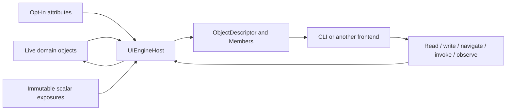

# Architecture

UIEngine presents a live .NET object graph through a small concrete descriptor model. Frontends
hold handles, paths, bindings, and descriptors; they do not own a recursively copied object tree.



## Dependency Direction

```text
Frontend/Cli ---------------------> Core
       |                             ^
       +----> Examples/CyclicDomain-+

Tests ----------------------------> implementation projects
```

Core has no frontend dependency. The example depends only on Core. Tests exercise the public
runtime and CLI behavior rather than provider precedence or decorator implementation details.

## Host and Identity

`UIEngineHost` owns roots, object handles, optional domain-identity indexes, canonical paths,
active action invocations, observation subscriptions, dispatch, and bounded-work settings.
`SetRoot` registers or replaces a named root; `RemoveRoot` removes it.

Every encountered reference object receives one `ObjectHandle(Guid Id)` for the host lifetime.
`DomainIdentity` is optional semantic identity that can survive compatible replacement.
`LogicalPath` is a human-readable graph route. Keeping these concepts separate lets the runtime
represent cycles and shared references without recursively wrapping objects.

The host has one optional-options constructor. Options contain immutable scalar exposures, an
`IInteractionDispatcher`, collection and stream bounds, and logging configuration. The host copies
configuration internally and implements `IDisposable`.

## Discovery and Descriptors

Reflection is built into the host and remains opt-in:

- `[Expose]` marks scalar values or references.
- `[Children]` marks collections.
- `[Action]` marks instance methods.
- `[Summary]` marks a readable summary member.
- `IStableDomainIdentity` or `[DomainIdentitySource]` supplies domain identity.

Unannotated exact types can use immutable `TypeExposure<T>` definitions containing
`ValueExposure<T,TValue>` scalar values, plus optional identity and summary delegates.

`ObjectDescriptor` contains `Handle`, optional `DomainIdentity`, `TypeName`, optional `Summary`,
and one `Members` list. Its closed concrete member roles are:

| Type | Responsibility |
|---|---|
| `ValueDescriptor` | Live scalar read/write plus nullability, enum options, and range. |
| `ReferenceDescriptor` | Live nullable edge returned as an `ObjectHandle`. |
| `CollectionDescriptor` | Bounded collection slices and internal selector lookup. |
| `ActionDescriptor` | Parameter binding and creation of an `ActionInvocation`. |

`ActionParameter` remains a separate metadata record. Descriptors hold their host and owner handle,
so both reflection and programmatic values use the same dispatch, target resolution, conversion,
validation, cancellation, and error normalization.

## Paths and Bindings

Logical paths are absolute, case-sensitive, and percent-escaped. A collection edge may use one
canonical selector:

```text
/world/Nations[index=0]
/catalog/Items[key=SKU-42]
/world/Nations[identity=nation%2FN1]
```

`ResolvePathAsync` returns `InteractionResult<ResolvedPath>`. Successful object resolution retains
the traversed `PathLocation` values, which support breadcrumbs and parent navigation.

`ResolveBindingAsync` accepts a `BindingReference` containing a required object path, member ID,
expected `MemberKind`, and optional domain identity. It may recover an unavailable path through a
known identity, but it rejects a path that resolves to a conflicting identity.

## Values and Validation

Value writes and action arguments use invariant conversion followed by nullability, enum-option,
range, and DataAnnotations validation. Read-only writes return a validation issue. Expected
failures return `InteractionResult<T>` with one consolidated `InteractionErrorCode` and optional
`ValidationIssue` values carrying the member or parameter ID.

The stable error categories are invalid input, not found, unavailable, ambiguous, type mismatch,
unsupported, conversion, validation, permission, cancellation, disposed, and unexpected fault.

## Collections

`CollectionDescriptor.ReadAsync(long offset, int limit, CancellationToken)` is the only public
collection operation. It returns a `CollectionSlice` with offset, entries, optional total count,
and `HasMore`. Host limits bound indexed and lazy-enumerable work.

Entries form a closed hierarchy: `NullCollectionEntry`, `ScalarCollectionEntry`, and
`ReferenceCollectionEntry`. Position and optional dictionary key live on the base record. Paging
tokens, modes, and capability flags are intentionally absent.

## Actions

Reflection supports synchronous methods and `Task`/`Task<T>` methods. User parameters precede
optional injected `IProgress<T>` and `CancellationToken` parameters. `ValueTask` is not supported.

Every invocation returns concrete `ActionInvocation` with running, succeeded, failed, or cancelled
status; a completion result; a bounded progress stream; an optional trusted `Fault`; and
`bool Cancel()`. The host tracks running invocations and completes them as disposed during host
shutdown.

## Observation

`ObserveAsync` returns concrete `ObservationSubscription : IDisposable`. Without a polling
interval, the target must provide `INotifyPropertyChanged` or `INotifyCollectionChanged`. Supplying
a positive interval explicitly selects polling for one readable value or reference.

Notification observation follows replacement of an observable collection. Subscriptions detach
handlers deterministically. Observation and invocation progress share one internal bounded stream;
observation overflow is emitted as `BUFFER_OVERFLOW` with a dropped-record count.

## Dispatch and Diagnostics

All live operations flow through the host. The default `InlineInteractionDispatcher` runs them
immediately; an application can provide the sole dispatch extension interface for thread-affine
domains. Reentrant access is allowed when `CheckAccess()` is true.

Expected structured failures are not logged. The host logs only unexpected discovery, dispatch,
observation, and invocation faults, with sensitive exception details disabled unless explicitly
enabled.

## Example Graph

```text
world (World)
  Nations[index=0] (Nation)
    Capital (City)
      OwnerNation ----------> same Nation handle
    Cities[index=0] --------> same City handle
  Economy (EconomicProfile, immutable scalar exposure)
  PopulationForecast (10,000 computed scalar entries)
```

This graph exercises cycles, shared references, replacement, programmatic exposure, bounded
collection reads, observation, validation, and actions.
