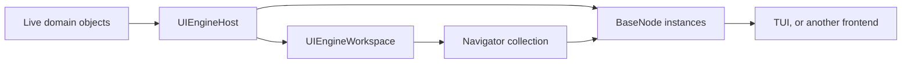

# Architecture

UIEngine presents a live .NET object graph through frontend-neutral `BaseNode`s. A workspace
holds independent `Navigator`s, and each navigator resolves one path through that graph at a time.



## Boundaries

### `UIEngineHost`

The host owns:

- registered domain roots;
- runtime handles;
- reflection and programmatic exposure;
- path resolution and live operations;
- domain-thread-affine interaction; and
- non-owning diagnostic reporting for invocation faults.

Hosts are isolated and disposable. Their live graph operations are synchronous and must be called
on the domain model's owning thread. They contain no process-global registry, frontend state, or
thread-marshaling mechanism.

### `UIEngineWorkspace`

A workspace is a frontend-neutral navigation session over one host. It owns an ordered collection
of `Navigator`s and produces a serializable workspace snapshot. A host can support more
than one workspace without sharing navigation state between them.

### Frontends

A frontend maps node semantics to controls and owns all toolkit state. It may create a workspace,
or present a caller-supplied workspace. Core never references controls, focus, colors, geometry,
key bindings, or a UI dispatcher.

## Object Nodes

Every exposed root and member resolves to an `BaseNode`. A node represents one live exposure
occurrence; it is not a recursively copied object tree.

Node types and interfaces describe .NET language semantics. The model includes concepts such as:

- object and reference;
- property and field;
- method;
- collection and element;
- string, boolean, number, and enum; and
- nullability, mutability, and validation metadata.

Names follow those concepts—for example, `PropertyNode`, `MethodNode`, `NumberNode`, and
`EnumNode`—rather than presentation archetypes. Concrete variants and semantic interfaces may be
combined where the language concepts overlap.

Semantic facets may overlap. For example, a writable enum property has property, enum, and
writable semantics. Its frontend chooses an appropriate editor from those semantics without Core
naming a widget such as a choice control.

The source of an exposure and its value shape are independent facets:

| Exposure | Membership facet | Additional facets |
|---|---|---|
| Reflected property | `IPropertyNode` | Readable/writable/nullability and value-shape facets |
| Reflected field | `IFieldNode` | Readable/writable/nullability and value-shape facets |
| Reflected method | `IMethodNode` | Parameter, result, and invocation-status metadata |
| Programmatic scalar | `IProgrammaticValueNode` | Readable/writable/nullability and value-shape facets |

A programmatic scalar is deliberately not an `IPropertyNode` or `IFieldNode`; it is an exposed
value without a reflected-member claim. String, character, Boolean, number, and enum facets are
orthogonal to membership, reading, writing, and nullability.

Nodes expose the live operations appropriate to their semantics:

- readable nodes read the current value;
- writable nodes convert, validate, and write;
- reference and object nodes expose navigable members;
- collection nodes return bounded windows and expose navigable reference elements; and
- method nodes bind parameters and start invocations.

Every node may be displayed as a navigator's current node. Scalar and method nodes are terminal.
A method result is presented by the method node and does not implicitly create a navigation edge.

Node instances are not shared between navigators. Two navigators at the same path have independent
node and presentation instances while operating on the same live domain object.

## Handles and Paths

UIEngine keeps two concepts separate:

| Concept | Purpose |
|---|---|
| `Guid` | Identifies one live reference within a host lifetime. |
| `LogicalPath` | Identifies how a navigator reached an exposed node. |

Logical paths are immutable, case-sensitive linked structures. Core stores member names, list
indices, and dictionary keys directly without encoding them into a string.

```text
/world
/world/Name
/world/Nations
/world/Nations[index=0]
/catalog/Items[key=SKU-42]
```

Each linked segment expresses one navigation step. `MemberLogicalPathSegment` names an unselected
member, `ListLogicalPathSegment` identifies one list index, and `DictLogicalPathSegment` identifies
one dictionary key. Resolution verifies that the live collection provides the corresponding list
or dictionary semantics. Future selection or batch operations extend the model with additional
logical-path segment variants.

A path can end at any node, not only a reference object. Parent traversal follows navigation
semantics: the parent of a selected collection element is its collection node, and the parent of a
member is its containing node.

Path resolution returns a fresh node plus its canonical path. It follows the current graph, so a
path naturally resolves to a replacement object when the corresponding root, member, or collection
entry changes.

The returned resolution chain contains one fresh `ResolvedNode` for every linked semantic location
from the registered root through the current node. A selected collection element therefore follows
its collection node directly in both the logical path and the resolution chain.

`LogicalPath.ToString()` is diagnostic display only and is not a serialization format. Frontends
own any command-text grammar, while layout persistence stores structured path segments.

`ResolvedNode` is the Core-owned hand-off for that pair. It retains its originating host
internally so a workspace can reject an occurrence from another host, while neither
`BaseNode` nor its semantic facets expose a logical path.

## Navigators

A `Navigator` is one independent entry point into the graph. It owns a stack of navigation entries.
Each entry contains:

- a logical path;
- the resolved `BaseNode`, when available; and
- structured resolution state.

Navigation has destructive stack semantics:

1. Starting a navigator resolves its initial node and pushes the first entry.
2. Activating a navigable child resolves a fresh node and pushes a new entry.
3. Going back removes and disposes the current entry, then reveals the previous entry.
4. There is no forward history.
5. Removing a navigator disposes all of its entries.

A navigator may start from a registered root or a specific resolved `BaseNode`. The workspace
captures the node's current location and resolves a navigator-owned instance. Duplicating a
navigator follows the same rule at the current path, so the two navigators do not share nodes.

Navigator mutations and path resolution run synchronously on the domain thread. A successful
mutation returns the same committed change object published by its change notification; a failed
mutation publishes no change. Since Core does not queue or dispatch mutations, it cannot later
restore stale navigation state after back, removal, or disposal.

If a path cannot resolve, the current entry remains present with its structured failure. Back
navigation remains available. A restored broken path therefore stays visible and can be unwound
until a valid node is reached.

## Workspace Snapshots and Layout Persistence

A workspace creates an unversioned snapshot containing:

- navigator order and names;
- each navigator's current structured logical path; and
- the selected navigator name.

Each supported `ILogicalPathSegment` has a corresponding serializable snapshot type. Restore is
optimistic: malformed navigator records are reported and skipped without discarding usable records,
and unknown serialized fields do not require a schema-version gate.

The snapshot does not contain domain values, runtime handles, node instances, control instances,
edit drafts, invocation state, or running work.

Deserialization reconstructs navigation entries from each saved path and its semantic parent
locations. Resolution failures create broken current entries rather than dropping saved
navigators. Frontends own any outer layout contract and stable presentation configuration such as
placement or size. Serialization produces data; file storage remains the caller's responsibility.

## Operations and Lifetime

All live operations flow synchronously through the host on the domain model's owning thread.
Expected outcomes use `Either<InteractionError, T>` with stable error codes and validation issues;
nullable success values use `Either<InteractionError, Option<T>>`. If a frontend runs on another
thread, the embedding application owns the request boundary into the domain thread; Core does not
marshal work to or from UI threads.

Collection access is always bounded. Collection windows retain positions, optional keys, nulls,
scalar values, references, optional total counts, and whether more data is available.

Each method-node occurrence exposes its latest invocation status and a result task carrying the
structured outcome for that exact call. Synchronous execution is observable as running, and one
occurrence accepts only one running call at a time. Separate occurrences can invoke the same domain
method concurrently. Once reflection returns a domain task, that task continues independently of the
node and host; the node only observes its outcome.

## Frontend Lifetime

For every active navigation entry, a frontend creates a control. Invocation updates are applied
only while that entry is still current.

When an entry is removed, the frontend removes its control and detaches its completion continuation.
Already-started domain tasks may finish, but they cannot update a detached visual tree. Host disposal
does not cancel them or replace their natural outcome with a host-lifetime failure.

Removing one navigator cannot interfere with work owned by another navigator, even when both point
to the same path.

## Dependency Direction

```text
Domain application ----------> Core
Frontend/Tui ----------------> Core + XenoAtom.Terminal.UI
Examples --------------------> domain + selected frontend
Tests -----------------------> implementation projects
```

Core has no frontend dependency. Frontends do not depend on a specific domain assembly.
