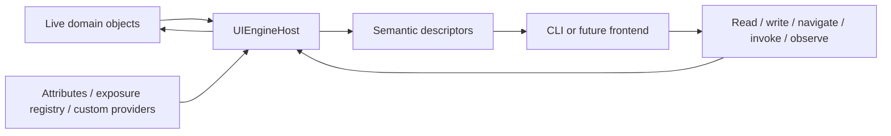

# Architecture and Core Modules

This document describes the architecture implemented by the current Framework MVP. It is an
implementation guide, not a replacement for the settled product constraints in
[`PROJECT_CONTEXT.md`](../PROJECT_CONTEXT.md) or the roadmap in
[`REBOOT_PLAN.md`](../REBOOT_PLAN.md).

## Architectural shape

UIEngine exposes a live .NET object graph as frontend-neutral semantic descriptors. A frontend
never owns a copied tree of domain state: it holds paths, bindings, handles, and descriptors that
read or mutate the live objects through a host.



The design is a graph runtime rather than a tree renderer. Cycles and shared references are
normal, object instances may be replaced, collections may be too large to materialize, and
expected failures are values rather than exception strings.

The central dependency rule is:

```text
Frontend/Cli ---------------------> Core
       |                             ^
       +----> Examples/CyclicDomain-+

Tests ----------------------------> implementation projects
UIEngine                           (isolated legacy reference implementation)
```

`Core/Core.csproj` has no dependency on a frontend toolkit. The CLI references `Core` and the
example domain. The example references only `Core`. The remaining legacy project is characterized
separately and is not an API foundation for the reboot.

## Runtime flow

One interaction follows these stages:

1. The application constructs `UIEngineHost` with an immutable snapshot of service options.
2. It registers one or more named root object references.
3. Encountered reference objects receive a host-scoped `ObjectHandle` and runtime identity.
4. The host discovers optional domain identity and selects a descriptor provider.
5. The provider describes semantic values, references, collections, and actions without recursively
   expanding the graph.
6. The host wraps descriptors so live operations pass through the configured dispatcher, safety
   limits, diagnostics, and normalized invocation behavior.
7. A frontend navigates with logical paths and resolves durable bindings before each operation.
8. Operations return `InteractionResult<T>` with either a value or a structured error and issues.

The host owns roots, identities, subscriptions, active invocations, provider configuration, and
lifetime. There are no global registries. Disposing the host clears its indexes, disposes active
subscriptions, and completes active invocations with `HOST_DISPOSED`.

## Projects and assembly boundaries

| Project | Responsibility |
|---|---|
| `Core/Core.csproj` | Runtime contracts and implementation: hosting, identity, exposure, descriptors, paths, bindings, validation, collections, observation, invocation, reflection, and diagnostics. |
| `Frontend/Cli/Cli.csproj` | Proving executable that parses and presents commands over Core contracts. PrettyPrompt supplies interactive editing and completion only. |
| `Examples/CyclicDomain/CyclicDomain.csproj` | Deterministic cyclic model used by the CLI and acceptance tests, including annotated and programmatically exposed types. |
| `Tests/UIEngine.Framework.Tests` | Core contract, behavior, dependency, identity, dispatch, binding, validation, collection, observation, and invocation tests. |
| `Tests/UIEngine.Frontend.Cli.Tests` | CLI syntax, completion, navigation, live operation, recovery, progress, cancellation, and redirected-session tests. |
| `Tests/UIEngine.Legacy.Characterization.Tests` | Narrow characterization of useful legacy concepts without making the legacy API a compatibility target. |
| `UIEngine/UIEngine.csproj` | Legacy v0.2.3 tree-based prototype; isolated reference material. |

Logical areas in `Core` are directories and namespaces, not separate assemblies. A new assembly is
justified only by a real dependency, deployment, packaging, target-framework, or tooling boundary.

## Core modules

### Hosting

Files: `Core/Hosting/`

`UIEngineHost` is the composition root and ownership boundary. `UIEngineHostOptions` configures:

- programmatic exposure;
- ordered descriptor, domain-identity, and observation providers;
- the interaction dispatcher;
- observation polling and buffer limits;
- collection page and snapshot limits;
- invocation progress buffering; and
- structured logging and sensitive-detail policy.

Options are validated and copied into `UIEngineHostConfiguration` at construction, so later
mutations to input collections cannot alter a running host.

`DispatchedObjectDescriptor` snapshots descriptive metadata and wraps every live read, write,
reference access, collection read, and action call. Operations use `IInteractionDispatcher` unless
a provider explicitly opts a particular operation out through `IInteractionDispatchPolicy`. This
keeps thread-affine domain access explicit and makes nested/reentrant dispatch safe.

### Descriptors

File: `Core/Descriptors/DescriptorContracts.cs`

Descriptors express domain semantics rather than UI controls:

| Contract | Meaning |
|---|---|
| `IObjectDescriptor` | One live object's type, summary, identities, and member descriptors. |
| `IValueDescriptor` | Readable/writable scalar state plus nullability, selection, range, validation, unit, and tags. |
| `IReferenceDescriptor` | A nullable edge to another object, returned as an `ObjectHandle`. |
| `ICollectionDescriptor` | A capability-advertised, explicitly bounded collection view. |
| `IActionDescriptor` | An operation with parameters, result, async, cancellation, progress, risk, and confirmation metadata. |
| `IObjectDescriptorProvider` | An extension point that creates descriptors for supported runtime types. |

Metadata is safe for a frontend to retain. Live operations re-read the current domain state; the
descriptor model is not a mirrored object model.

### Identity

Files: `Core/Identity/`

UIEngine deliberately separates three concepts:

- `ObjectIdentity` is reference-based, stable only within one host lifetime, and represented to
  frontends through `ObjectHandle`.
- `DomainIdentity` is an optional semantic key intended to survive compatible object replacement
  or restart.
- `LogicalPath` is a human-readable route through exposed semantics and a fallback resolution
  mechanism.

The host indexes objects lazily as they are encountered and holds weak references outside its
strongly held roots. Repeated encounters with the same object reference return the same runtime
identity, so cycles and shared references do not create duplicate wrapper subtrees.

Domain identity discovery uses this precedence:

1. the exact-type callback registered in `ExposureRegistry`;
2. the first configured `IDomainIdentityProvider` that supports the type; and
3. built-in `IStableDomainIdentity` and `[DomainIdentitySource]` discovery.

Conflicting or invalid identity sources produce structured failures. Domain-identity lookup only
finds live objects already encountered by that host; it does not scan the complete graph.

### Exposure and reflection

Files: `Core/Attributes/`, `Core/Exposure/`, and `Core/Reflection/`

There are three descriptor tiers, in deterministic precedence order:

1. exact-runtime-type definitions in the host's `ExposureRegistry`;
2. the first configured custom `IObjectDescriptorProvider` that accepts the type; and
3. the configured `ReflectionObjectDescriptorProvider` fallback.

Programmatic exposure supports third-party or runtime-dependent types and can define identity,
summary, values, references, collections, actions, validation metadata, or a custom descriptor
factory. Registered definitions override same-named reflected members; remaining reflected members
may be composed into the result.

Reflection exposure is opt-in. Public instance properties or fields use `[Expose]` for scalar or
reference semantics, `[Children]` for collection semantics, `[Action]` for methods, `[Summary]` for
the object summary, and `[DomainIdentitySource]` for semantic identity. Type metadata is cached;
member operations still access the live instance.

The reflection layer normalizes nullable annotations, data-annotation validation, enum selections,
range metadata, conversions, synchronous/asynchronous action shapes, injected progress, and
cancellation into the common descriptor contracts.

### Logical paths and bindings

Files: `Core/Binding/`

`LogicalPath` parses and formats absolute, case-sensitive semantic paths. Collection members use
canonical `[index=...]`, `[key=...]`, or `[identity=...]` selectors, with UTF-8 percent escaping.
`LogicalPathResolver` traverses one descriptor edge at a time, records canonical locations, and
returns explicit missing, ambiguous, invalid, mismatched, or unavailable states.

`BindingReference` is a data-only durable record containing optional domain identity, optional
path, member identifier, expected descriptor role, optional type, and a fallback policy.
`BindingResolver` resolves it to a transient live descriptor. Domain-identity-first resolution can
recover compatible replacements, while identity and type checks prevent a path from silently
reattaching to a different target.

### Interactions and validation

Files: `Core/Interaction/`

`InteractionResult<T>` is the common operation boundary. Failures contain an
`InteractionErrorCode`, a human-readable message, and optional `InteractionIssue` records with
stable issue category, target kind, and target identifier. Frontends branch on codes and metadata;
they do not parse messages.

Validation covers nullability, read-only state, numeric ranges, finite selections, data annotations,
programmatic synchronous/asynchronous rules, and action preconditions. Conversion and validation
remain distinct failure categories.

### Collections

File: `Core/Collections/CollectionContracts.cs`

Collections advertise capabilities such as finite snapshot, paging, virtualized range, indexing,
keys, and live observation. Every `CollectionReadRequest` has an explicit mode, offset, and positive
limit. Host configuration enforces maximum work even if a provider advertises a broader surface.

Results preserve entry position and optional key, and distinguish null, scalar, and reference
entries. They also report an optional total count, `hasMore`, and page continuation token. Path
selection is a separate capability so normal browsing never needs to materialize an arbitrary
enumerable just to navigate.

### Invocation

File: `Core/Invocation/InvocationContracts.cs`

Every action returns an `IActionInvocation`, whether the underlying method is synchronous or
asynchronous. The invocation has one terminal state and result, an optional cancellation channel,
and a single-reader bounded progress stream with ordered records. Domain exceptions become
structured invocation failures while trusted local fault details remain available through
`InvocationFault`.

The host tracks active invocations so disposal and diagnostics have deterministic behavior.

### Observation

Files: `Core/Observation/`

`UIEngineHost.ObserveAsync` creates a host-owned `IObservationSubscription`. Observation can use:

1. the first matching configured `IObservationAdapter`;
2. built-in `INotifyPropertyChanged` or `INotifyCollectionChanged` support; or
3. explicitly requested polling for readable values and references.

Changes are normalized as ordered `ChangeRecord` values with source identities, member, change
kind, optional old/new values, and optional collection indices. Each subscription uses a bounded
single-reader buffer. Overflow is visible as `BUFFER_OVERFLOW` with a dropped-record count rather
than being silently hidden.

Subscriptions detach domain handlers when disposed, and host disposal terminates all remaining
subscriptions.

### Dispatch and diagnostics

Files: `Core/Hosting/` and `Core/Diagnostics/`

The dispatcher controls the execution context for descriptor discovery, summary reads, value and
reference operations, collection access, actions, observation setup, and polling. The default
`InlineInteractionDispatcher` executes immediately; applications with thread affinity provide an
alternative implementation.

`Microsoft.Extensions.Logging` events cover host lifetime, discovery, configuration, binding,
validation, mutation, invocation, observation, collection access, dispatch failures, and capability
mismatches. Event identifiers are stable in `UIEngineDiagnosticEventIds`. Exception details are
omitted unless `IncludeSensitiveDiagnosticData` is enabled.

## CLI boundary

`Frontend/Cli/CliSession` owns only presentation-level responsibilities:

- tokenize one command line;
- select a command and check its arity;
- maintain the current location binding;
- turn arguments into Core requests;
- format descriptor data, results, progress, changes, issues, and errors; and
- dispose its subscriptions and host.

Core—not the CLI—owns path grammar and resolution, binding recovery, type conversion, validation,
dispatch, collection bounds, observation normalization, and invocation lifecycle. This division is
the proof that a future TUI can reuse the same semantics without calling CLI code.

## Example graph

The deterministic example exercises both a cycle and mixed exposure strategies:

```text
world (World)
  Nations[index=0] (Nation)
    Capital (City)
      OwnerNation ----------> same Nation runtime identity
    Cities[index=0] --------> same City runtime identity
  Economy (EconomicProfile, programmatic exposure)
  PopulationForecast (10,000-item virtualized scalar collection)
```

`World`, `Nation`, and `City` use reflection attributes and built-in identity sources.
`EconomicProfile` is intentionally unannotated and exposed through the host-scoped registry. The
large forecast demonstrates bounded access without unconditional materialization.

## Current boundaries

The implemented Framework MVP includes the runtime and proving CLI. It does not yet include the
product TUI, persistent layouts/workbenches, batch operations, remote transport, arbitrary
scripting, automatic undo, or a supported package. Those features must build on the same semantic
contracts and preserve the frontend-to-Core dependency direction.

## Verification map

When changing an area, run its focused test project first:

```sh
dotnet test Tests/UIEngine.Framework.Tests/UIEngine.Framework.Tests.csproj
dotnet test Tests/UIEngine.Frontend.Cli.Tests/UIEngine.Frontend.Cli.Tests.csproj
```

The repository-level required check is:

```sh
dotnet build UIEngine.sln
```

The complete suite can be run with:

```sh
dotnet test UIEngine.sln
```
