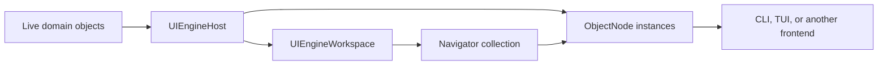

# Architecture

UIEngine presents a live .NET object graph through frontend-neutral `ObjectNode`s. A workspace
holds independent `Navigator`s, and each navigator resolves one path through that graph at a time.



## Boundaries

### `UIEngineHost`

The host owns:

- registered domain roots;
- runtime handles and optional stable domain identities;
- reflection and programmatic exposure;
- path resolution and live operations;
- domain dispatch;
- observation subscriptions; and
- started invocation lifetime.

Hosts are isolated and disposable. They contain no process-global registry or frontend state.

### `UIEngineWorkspace`

A workspace is a frontend-neutral navigation and layout session over one host. It owns an ordered
collection of `Navigator`s and produces a serializable layout snapshot. A host can support more
than one workspace without sharing navigation state between them.

### Frontends

A frontend maps node semantics to controls and owns all toolkit state. It may create a workspace,
or present a caller-supplied workspace. Core never references controls, focus, colors, geometry,
key bindings, or a UI dispatcher.

## Object Nodes

Every exposed root and member resolves to an `ObjectNode`. A node represents one live exposure
occurrence; it is not a recursively copied object tree.

Node types and interfaces describe .NET language semantics. The model includes concepts such as:

- object and reference;
- property and field;
- method;
- collection and element;
- string, boolean, number, and enum; and
- nullability, mutability, and validation metadata.

Names follow those concepts—for example, `PropertyNode`, `MethodNode`, `NumberNode`, and
`EnumNode`—rather than presentation archetypes. Concrete variants and semantic interfaces may be
combined where the language concepts overlap.

Semantic facets may overlap. For example, a writable enum property has property, enum, and
writable semantics. Its frontend chooses an appropriate editor from those semantics without Core
naming a widget such as a choice control.

Nodes expose the live operations appropriate to their semantics:

- readable nodes read the current value;
- writable nodes convert, validate, and write;
- reference and object nodes expose navigable members;
- collection nodes return bounded windows and expose navigable reference elements; and
- method nodes bind parameters and start invocations.

Every node may be displayed as a navigator's current node. Scalar and method nodes are terminal.
A method result is presented by the method node and does not implicitly create a navigation edge.

Node instances are not shared between navigators. Two navigators at the same path have independent
node and presentation instances while operating on the same live domain object.

## Identity and Paths

UIEngine keeps three concepts separate:

| Concept | Purpose |
|---|---|
| `ObjectHandle` | Identifies one live reference within a host lifetime. |
| `DomainIdentity` | Optionally identifies a domain entity across compatible replacement. |
| `LogicalPath` | Identifies how a navigator reached an exposed node. |

Logical paths are absolute, case-sensitive, and percent-escaped. Collection elements use an
explicit index, key, or domain-identity selector.

```text
/world
/world/Name
/world/Nations
/world/Nations[index=0]
/catalog/Items[key=SKU-42]
/world/Nations[identity=nation%2FN1]
```

A path can end at any node, not only a reference object. Parent traversal follows navigation
semantics: the parent of a selected collection element is its collection node, and the parent of a
member is its containing node.

Path resolution returns a fresh node plus its canonical path. Resolution may use stable domain
identity to survive compatible replacement, but it must reject a path that resolves to a
conflicting identity.

## Navigators

A `Navigator` is one independent entry point into the graph. It owns a stack of navigation entries.
Each entry contains:

- a logical path;
- the resolved `ObjectNode`, when available; and
- structured resolution state.

Navigation has destructive stack semantics:

1. Starting a navigator resolves its initial node and pushes the first entry.
2. Activating a navigable child resolves a fresh node and pushes a new entry.
3. Going back removes and disposes the current entry, then reveals the previous entry.
4. There is no forward history.
5. Removing a navigator disposes all of its entries.

A navigator may start from a registered root or a specific resolved `ObjectNode`. The workspace
captures the node's current location and resolves a navigator-owned instance. Duplicating a
navigator follows the same rule at the current path, so the two navigators do not share nodes.

If a path cannot resolve, the current entry remains present with its structured failure. Back
navigation remains available. A restored broken path therefore stays visible and can be unwound
until a valid node is reached.

## Layout Persistence

A workspace serializes a versioned layout containing:

- navigator order and identifiers;
- each navigator's current logical path; and
- stable presentation configuration such as placement or size.

Each navigator produces its own serializable path and stable configuration. The workspace
aggregates those records into the layout snapshot.

The snapshot does not contain domain values, runtime handles, node instances, control instances,
edit drafts, subscriptions, invocation progress, or running work.

Deserialization reconstructs navigation entries from each saved path and its semantic parent
locations. Resolution failures create broken current entries rather than dropping saved
navigators. Serialization produces data; file storage remains the caller's responsibility.

## Operations and Lifetime

All live operations flow through the host and its `IInteractionDispatcher`. Expected outcomes use
`InteractionResult<T>` with stable error codes and validation issues.

Collection access is always bounded. Collection windows retain positions, optional keys, nulls,
scalar values, references, optional total counts, and whether more data is available.

Method invocation returns an `ActionInvocation` with terminal status, completion, bounded ordered
progress, and optional cancellation support. Once started, an invocation is owned by the host.
Removing a node or control stops only frontend observation of that invocation.

Observation uses domain notifications or explicit polling. Streams are bounded, overflow is
visible, and subscriptions detach deterministically.

## Frontend Lifetime

For every active navigation entry, a frontend creates a control and an independent frontend
operation scope. The scope owns reads, observation subscriptions, and progress readers started by
that control.

When an entry is removed, the frontend disposes its control and scope. This cancels frontend work
and prevents updates to a detached visual tree. It does not dispose the host, stop the domain
object, or cancel a started invocation.

Removing one navigator cannot cancel work owned by another navigator, even when both point to the
same path.

## Dependency Direction

```text
Domain application ----------> Core
Frontend/Cli ----------------> Core
Frontend/Tui ----------------> Core + XenoAtom.Terminal.UI
Examples --------------------> domain + selected frontend
Tests -----------------------> implementation projects
```

Core has no frontend dependency. Frontends do not depend on a specific domain assembly.
